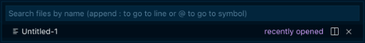
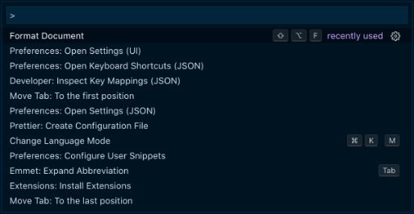

# shift shift

*Require VS Code 1.54 or above / VS Code Insider*

Providing shorts `shift+shift` and `ctrl+ctrl` to call `quick open` and `command palette` without editing keybindings.json.

## How to use

`shift + shift` or `alt + alt`

`ctl + ctl`

